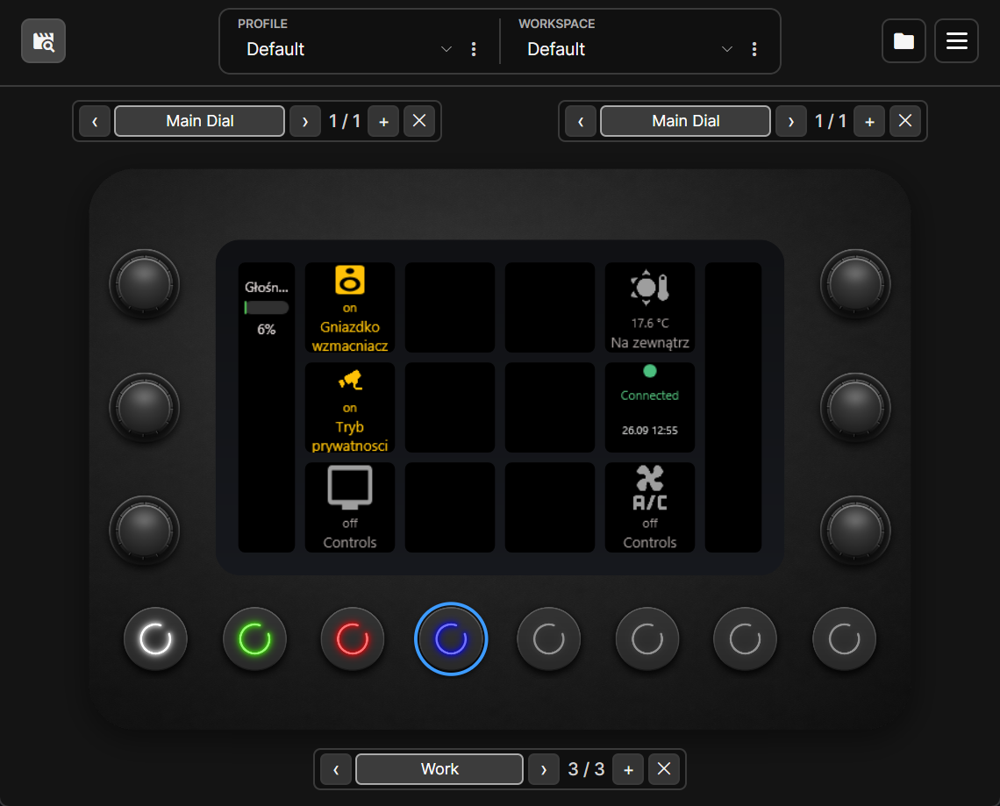
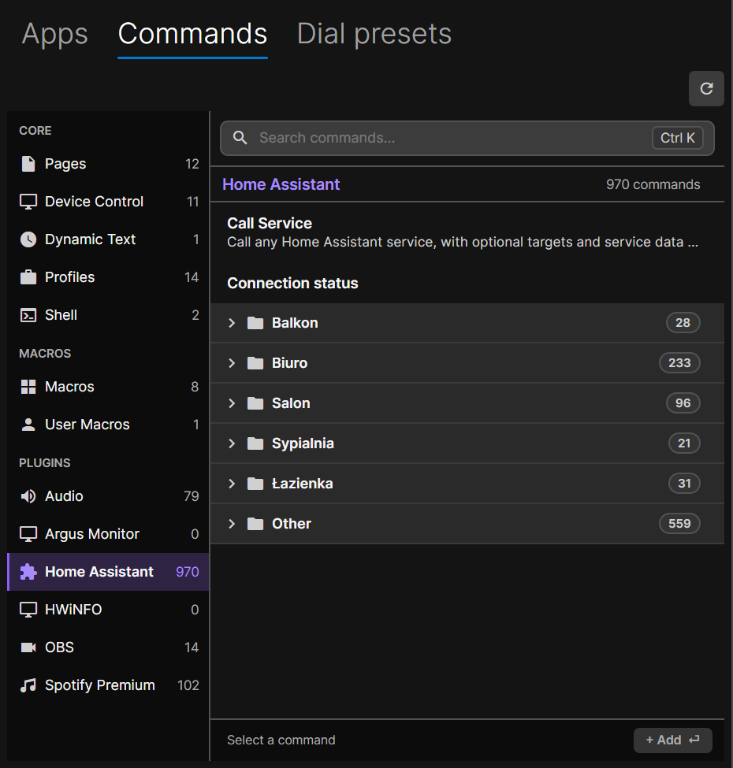
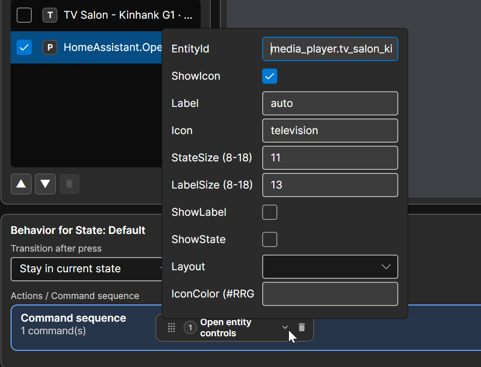

# Home Assistant for LoupixDeck

Control Home Assistant directly from [LoupixDeck](https://github.com/RadiatorTwo/LoupixDeck) with live entity states, dynamic controls and rotary support.

<p align="center">
  
</p>

## Features

- Browse Home Assistant entities by area directly in the LoupixDeck command picker.
- Show live entity states, values and units on touch buttons.
- Use Home Assistant and MDI icons with automatic state-aware coloring.
- Open live control folders for devices with multiple actions.
- Control common entities such as lights, switches, covers, climate devices, fans, media players and locks.
- Display sensor values without creating custom commands.
- Control dimmable light brightness from a rotary encoder.
- Customize each button label, icon, visibility, text size, layout and icon color.
- Use a generic Call Service command for advanced Home Assistant actions.

<p align="center">
  
</p>

## Requirements

- LoupixDeck with a Plugin SDK compatible with version 1.26.0.
- A Home Assistant instance reachable from the computer running LoupixDeck.
- A Home Assistant Long-Lived Access Token.

## Installation

Download `homeassistant-0.1.0-any.zip` from the [GitHub Releases page](https://github.com/Vencite/LoupixDeck.Plugin.HomeAssistant/releases).

In LoupixDeck, open the Plugins window, go to the installed plugins page and install the downloaded ZIP. Restart LoupixDeck if requested.

The release package is built by the official LoupixDeck Plugin SDK release workflow.

## Connect to Home Assistant

1. In Home Assistant, open your profile.
2. Open `Security`.
3. Create a `Long-Lived Access Token`.
4. Open the Home Assistant plugin settings in LoupixDeck.
5. Enter the Home Assistant URL and token, then save.
6. Use `Test Connection` to verify the configuration.

The token is stored in the LoupixDeck plugin settings. It should never be placed in button command parameters.

## Add controls

Open the LoupixDeck command picker and choose:

`Home Assistant > Area > Entity type > Entity > Action`

The available actions are generated from the entities and capabilities reported by Home Assistant.

For entities with multiple useful actions, choose `Controls folder` to open a live control page on the deck.

A `Connection status` command is also available. It shows the current Home Assistant connection state and the time of the last entity update.

## Button customization

Entity buttons can use the automatic Home Assistant presentation or override it per binding.

<p align="center">
  
</p>

| Option | Purpose |
| --- | --- |
| `ShowIcon` | Show or hide the entity icon |
| `Label` | Use a custom label, or `auto` for the Home Assistant friendly name |
| `Icon` | Use a custom MDI icon, or `auto` for the resolved entity icon |
| `StateSize` | Change the state text size |
| `LabelSize` | Change the label text size |
| `ShowLabel` | Show or hide the label |
| `ShowState` | Show or hide the current state |
| `Layout` | Choose the icon and text arrangement |
| `IconColor` | Override the icon color with `#RRGGBB` |

MDI icon names can be entered with the `mdi:` prefix, for example `mdi:television`.

## Supported controls

The exact actions shown depend on the capabilities reported by Home Assistant.

| Entity type | Examples |
| --- | --- |
| Light | On, off, toggle, brightness |
| Switch and input boolean | On, off, toggle |
| Climate | Temperature controls and HVAC mode |
| Cover | Open, close, stop and position controls when supported |
| Fan | Power and percentage controls when supported |
| Media player | Playback and volume controls when supported |
| Lock | Lock and unlock |
| Sensor | Live read-only state with unit |
| Scene | Activate |
| Script | Run |
| Button | Press |

### Rotary controls

Dimmable lights expose a brightness dial preset.

- Rotate to change brightness in 5 percent steps.
- Press to toggle the light.
- The dial indicator uses the cached Home Assistant brightness value.

## Advanced: Call Service

<details>
<summary>Generic Home Assistant service calls</summary>

The `Call Service` command is available as an escape hatch for actions that do not have a dedicated control.

The current command shape is:

```text
HomeAssistant.CallService(Domain,Service,EntityId,ServiceData,Target)
```

`ServiceData` and `Target` are URI-escaped JSON objects. Use `none` when a positional value should be omitted.

Example for setting a light to 50 percent brightness:

```text
HomeAssistant.CallService(light,turn_on,light.example,%7B%22brightness_pct%22%3A50%7D,none)
```

Existing simple calls with domain, service and entity remain supported.

</details>

## Current limitations

- Rotary presets currently focus on light brightness.
- LoupixDeck can add its own Text or Symbol layer when an action is assigned. If that layer covers the plugin image, hide or remove it in the button editor.
- Custom MDI icons that are not available in the LoupixDeck built-in symbol set are fetched through Iconify and cached in memory. They may need an internet connection again after the plugin restarts.
- Avoid commas, parentheses and semicolons in custom labels because they are part of the host command syntax.
- The generic `Call Service` command does not provide the same live entity rendering as entity actions selected from the dynamic menu.

## Development

Build instructions and the release process are in [DEVELOPMENT.md](DEVELOPMENT.md).

## License

Plugin code is available under the MIT License. See [LICENSE](LICENSE).

The Home Assistant logo has separate attribution and licensing information in [LICENSES/home-assistant-logo.md](LICENSES/home-assistant-logo.md).

Developed with AI assistance.
